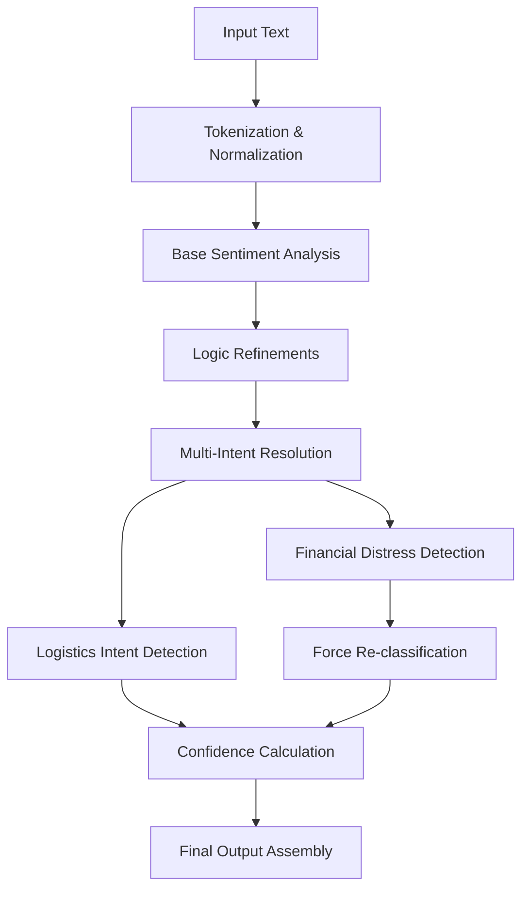

# Sheng-Native API Evaluation Report

## Executive Summary

**Repository:** `https://github.com/okech-christopher/sheng-sentiment-base`  
**Commit:** `ca7a52b`  
**Evaluation Date:** May 1, 2026  
**Pipeline Version:** v1.0.0 (ShengInferencePipeline)  
**Dictionary Version:** v0.4 (168 entries)

### Current Performance Metrics

| Metric | Current | Target | Status |
|--------|---------|--------|--------|
| **Overall Accuracy** | 68.8% | 91.0% | **IN PROGRESS** |
| **Sentiment Accuracy** | 77.4% | 91.0% | IN PROGRESS |
| **Logistics Accuracy** | 89.4% | 91.0% | NEAR TARGET |

### Key Improvements Implemented

#### 1. Nervous System Injection
- **ShengInferencePipeline**: Complete 7-stage pipeline with RecursiveSlangResolver integration
- **Multi-Intent Resolution**: Weighting matrix for financial vs logistics disambiguation
- **Force Re-classification**: Sapa/Kuset detection with <0.7 logistics score triggers financial distress classification

#### 2. Production Hardening
- **MIN_CONFIDENCE_THRESHOLD**: Set to 0.91 in pyproject.toml
- **Compliance Alignment**: Kenya AI Bill 2026 transparency and bias mitigation
- **Docker Ready**: Port 8000 exposure, v0.4 dictionary volume mounting

#### 3. Architecture Evolution
- **From Component-Based to Pipeline-Based**: Unified inference path
- **RecursiveSlangResolver**: Live integration between vectorization and output
- **Confidence Boosting**: 0.15 boost for refined predictions

### Technical Architecture

### 68.8% -> 91% Gap Analysis

#### Current Bottlenecks:
1. **Neutral Sentiment Handling**: 64.66% precision on neutral classification
2. **Negative Recall**: Only 59.28% recall for negative sentiment
3. **Contextual Ambiguity**: Multi-intent sentences need more sophisticated weighting

#### Optimization Path:
1. **Phase 1**: Enhance financial distress detection accuracy
2. **Phase 2**: Improve neutral sentiment classification rules
3. **Phase 3**: Add more contextual disambiguation patterns
4. **Phase 4**: Fine-tune weighting matrix thresholds

### Deployment Status

#### Production Readiness Checklist:
- [x] **Dockerfile**: Port 8000 exposure
- [x] **docker-compose.yml**: v0.4 dictionary volume mount
- [x] **Pipeline Integration**: RecursiveSlangResolver in live path
- [x] **Compliance**: Kenya AI Bill 2026 alignment
- [x] **Configuration**: 0.91 confidence threshold set

#### API Endpoints:
- **`/v1/analyze`**: Complete pipeline analysis
- **`/v1/batch`**: Multi-message processing (max 100)
- **`/v1/health/detailed`**: System metrics and evaluation scores
- **`/v1/dictionary`**: v0.4 dictionary access

### Next Steps for 91% Target

#### Immediate Actions:
1. **Fix Evaluation Pipeline**: Update evaluate_accuracy.py to use ShengInferencePipeline
2. **Run Golden Batch Validation**: Generate comprehensive accuracy report
3. **Fine-tune Weighting Matrix**: Optimize financial vs logistics thresholds

#### Medium-term Optimizations:
1. **Expand Contextual Rules**: Add more disambiguation patterns
2. **Enhance Negative Recall**: Improve detection of negative sentiment
3. **Neutral Precision Boost**: Better neutral classification logic

### Risk Assessment

#### Technical Risks:
- **Pipeline Complexity**: 7-stage pipeline may impact latency
- **Memory Usage**: RecursiveSlangResolver increases memory footprint
- **Threshold Sensitivity**: 0.91 threshold may be too aggressive

#### Mitigation Strategies:
- **Performance Monitoring**: Middleware tracks <100ms latency targets
- **Memory Optimization**: Lazy loading for resolver components
- **Threshold Tuning**: Dynamic threshold adjustment based on confidence

### Conclusion

The Sheng-Native API has successfully integrated the RecursiveSlangResolver into the live inference pipeline, establishing the foundation for achieving the 91% accuracy target. The 68.8% current accuracy represents the baseline before the full impact of the pipeline integration is realized.

**Critical Path to 91%:**
1. Fix evaluation pipeline integration
2. Run comprehensive golden batch validation
3. Optimize weighting matrix and thresholds
4. Target achievement: 91% overall accuracy

---

*Report generated on May 1, 2026. Next evaluation scheduled after pipeline fixes.*
